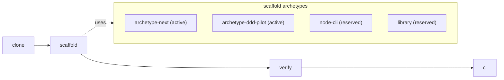

# TypeScript / Next.js Template — Setup Guide

> Clone this template, run one script, get a Next.js 16 project scaffolded
> with a green CI pipeline. See [ADR-002](docs/architecture/decisions/ADR-002-clone-script-scaffolding.md)
> for the architecture rationale.

## Phase 0: System Overview

> This template is designed for LLM agents to extend autonomously.



| ENV / Dependency | Type | Default | Change blast radius |
|---|---|---|---|
| Node.js toolchain | runtime | 20 LTS+ | high |
| `pnpm` package manager | runtime | required | high |
| `BASE_PACKAGE` / project name | scaffold param | required | medium |
| `.github/workflows/validate.yml` | CI workflow | committed | medium |
| `.agents/rules/plan-review-deep.md` | governance | byte-identical 3 templates | high |

### Adding a new archetype
Activate one of the reserved archetypes (`node-cli`, `library`) or add a new directory under `examples/` and update `scaffold.sh` archetype dispatch + the archetypes subgraph above. Phase 14b is the canonical Phase for archetype expansion.

### Adding a new verify step
Add a new `=== V<N> <name> ===` block to `validate.sh` AFTER V0a/V0e/V_seed and BEFORE V1+. Update F1 echo headers if the step exposes a new failure surface. See `.agents/rules/plan-review-deep.md` Section 2.

### Adding a new env dependency
Add a row to the ENV table above and rate its blast radius (low/medium/high). If required for `validate.sh` to run, add a presence guard at the top of `validate.sh`.

### Phase E (DDD/TDD) stack hook
1. Flexibility: small UL/BC edits (2-3 words or additions) allowed; core domain redefinition requires a new project.
2. Universality: rule semantics MUST be expressible in terms common to all 3 stacks (Spring/Python/TS).
3. Convention precedence: per-stack idiom > shared abstraction when they conflict -- convention wins, abstractions are opt-in.
4. Contract test specifications: every cross-stack rule has an executable contract test in each template (no English-only enforcement).
5. Opt-in examples / docs / CI only: examples + docs are opt-in; CI gates are opt-in unless a Phase explicitly opts a rule into the V0/V_seed contract.

---

## 1. Quick Start (three commands)

```bash
git clone https://github.com/llm-setup-templates/typescript-template my-app
cd my-app
bash ./scaffold.sh --project-name my-app --archetype next
```

> **Run under Bash** — not PowerShell or cmd.exe. On Windows this means
> Git Bash, WSL, or any shell where `bash --version` prints a version.
> The `bash` prefix is **load-bearing**: PowerShell's `.\scaffold.sh` form
> produces a silent no-op (exit 0, no scaffolding) in headless contexts
> (CI runners, agent sandboxes). scaffold.sh's internal guard catches
> dash/sh/zsh invocations that parse the script body, but PowerShell's
> invocation path never reaches that guard. See [RATIONALE.md § PowerShell
> Silent-No-Op](./RATIONALE.md) for the empirical test matrix.

Then install + verify locally:

```bash
npm install              # Activates Husky hooks via the prepare script
npm run verify           # format:check → typecheck → depcruise → lint → test → build
git add .
git commit -m "feat(scaffold): initial project setup"
```

## 2. scaffold.sh Reference

```
Usage: ./scaffold.sh --project-name <hyphen-case> [options]

Required:
  --project-name <name>     Project name in hyphen-case (e.g. my-app).
                            Pattern: ^[a-z][a-z0-9-]*$

Optional:
  --package-name <name>     npm package name. Defaults to --project-name.
                            npm scope supported: @org/name.
                            Pattern: ^(@[a-z0-9-]+/)?[a-z0-9][a-z0-9-]*$
  --archetype <name>        next (default) or ddd-pilot.
                            Reserved: node-cli, library (exit 1 with explicit message).
  --doc-modules <list>      comma-separated from {core,reports,briefings,extended}
                            default: core. 'core' is mandatory.
  --dry-run                 Print planned actions without writing.
  -h, --help                Print this usage.
```

**What scaffold.sh does** (8 stages, see [ADR-002](docs/architecture/decisions/ADR-002-clone-script-scaffolding.md)):

| Stage | Action |
|---|---|
| A | Remove template-only files (`validate.sh`, `.github/workflows/validate.yml`, `.github/workflows/scaffold-e2e.yml`, `test/`, `RATIONALE.md`, `CODERABBIT-PROMPT-GUIDE.md`, `tools/`, ADR-002, RFC-001). Keeps `.claude/` (agent rules) + `examples/` (used by Stage C). |
| B | Select archetype. Currently `next` only; `node-cli` / `library` exit with "reserved but not yet implemented". |
| C | Import Next seed (`examples/archetype-next/seed/`) + overlay template assets. Stage C asserts `examples/archetype-next/VERSION.md` Next major matches seed `package.json` `dependencies.next` major. `examples/ci.yml` lands at `.github/workflows/ci.yml`. |
| D | Substitute placeholders: `{{PROJECT_NAME}}` (AGENTS.md, src/app/layout.tsx metadata, package.json name), `{{PROJECT_ONE_LINER}}` (AGENTS.md). Bulk find/sed scope is `**/*.{md,yml,yaml}` excluding `examples/`, `node_modules/`, `.git/`. |
| E | Trim unselected doc modules (`docs/reports/`, `docs/briefings/`, `docs/architecture/{containers,DFD}.md` + `docs/data/`). |
| F | Remove `examples/`, defensive `tools/` removal (already gone from Stage A), and run `npx --no-install next telemetry disable` best-effort. |
| G | `rm -rf .git && git init -b main` (fresh history — template history not inherited). |
| H | Print next steps + self-delete (Linux/macOS auto, Windows Git Bash requires manual `rm scaffold.sh`). |

**Single-use**: scaffold.sh runs once on a freshly cloned template. It detects
`validate.sh` presence as a freshness marker; if missing (because a previous
scaffold run removed it), the script refuses to run and instructs you to re-clone.

## 3. Archetypes

This template ships **two archetypes**:

### 3.1 archetype-next (production starter)
Production-grade Next.js 16 baseline: `create-next-app --src-dir` + Jest 29 + native fetch + Tailwind v4 zero-config + ESLint 9 + Husky 9 + Dependency Cruiser FSD. Use for new production apps.

### 3.2 archetype-ddd-pilot (DDD/TDD learning track)
Production-realistic learning archetype: Vitest 4 (browser mode + Playwright Chromium) + Axios + Tailwind v4 + cn() + dot-role suffix + FSD-DDD hybrid + Order/OrderItem single-aggregate pilot. Mirrors Mind Signal frontend pattern. After scaffold + `npm install`, run `npx playwright install --with-deps chromium` (one-time) before `npm run verify`. See [examples/archetype-ddd-pilot/seed/README.md](./examples/archetype-ddd-pilot/seed/README.md) for full spec + 4 unique 가치축 + vs lapidix comparison + ADR-005 분기 사유.

`--archetype node-cli` and `--archetype library` are reserved (Stage B exits 1 with an explicit message). See [ADR-002 § Reserved Archetypes](docs/architecture/decisions/ADR-002-clone-script-scaffolding.md) and [ADR-005](docs/architecture/decisions/ADR-005-archetype-ddd-pilot-rationale.md) for the dual-archetype rationale.

## 4. Publish to GitHub (optional)

scaffold.sh does **not** create a GitHub repository — that's a separate
step, decoupled from scaffolding. This lets scaffold.sh work in offline
environments, self-hosted GitLab/Gitea mirrors, or air-gapped CI.

To publish after scaffolding + first commit:

```bash
gh auth status
gh repo create <repo-name> --private --source=. --remote=origin
git push -u origin main
```

### First-push CI recovery

If `git push` does not automatically trigger a CI run on `main` (race with
GitHub's default-branch bootstrap on brand-new repos), trigger manually:

```bash
gh workflow run ci.yml --ref main
gh run watch
```

`workflow_dispatch` is wired into `ci.yml` for this recovery case.

## 5. Verification

Full local verification loop:

```bash
npm run verify
# = npm run format:check && npm run typecheck && npm run depcruise && npm run lint && npm run test && npm run build
```

Runs in CI (`.github/workflows/ci.yml`) on every push to `main` / feature
branches and every pull request.

## 6. CODEOWNERS customization

**Required before enabling branch protection reviews.** `.github/CODEOWNERS`
ships with three placeholder groups:

- `@YOUR_ORG/engineering` — default owner (wildcard fallback)
- `@YOUR_ORG/architects` — decisions, FSD boundaries, dependency cruiser config
- `@YOUR_ORG/devops` — CI/CD, dependency surface

Sweep substitution:

```bash
# Solo project:
sed -i "s|@YOUR_ORG/[a-z-]*|@YOUR_USERNAME|g" .github/CODEOWNERS

# Team project (example):
sed -i "s|@YOUR_ORG/engineering|@my-team/eng|g;
        s|@YOUR_ORG/architects|@my-team/architects|g;
        s|@YOUR_ORG/devops|@my-team/platform|g" .github/CODEOWNERS

# Verify:
grep -n "YOUR_ORG\|YOUR_USERNAME" .github/CODEOWNERS  # must be empty
```

## 7. Troubleshooting

| Problem | Cause | Solution |
|---------|-------|----------|
| `scaffold.sh: /bin/bash^M: bad interpreter` | CRLF line endings (Windows) | `dos2unix scaffold.sh` or re-clone with `git -c core.autocrlf=false clone ...` |
| `ERROR: validate.sh not found` | scaffold.sh already ran once | Re-clone the template — scaffold.sh is single-use |
| `ERROR: scaffold.sh must be executed by Bash.` | Invoked via dash/sh/zsh that parsed the script body | Prefix `bash`: `bash ./scaffold.sh --project-name X --archetype next`. On Windows use Git Bash or WSL. |
| `./scaffold.sh` in PowerShell appears to do nothing (exit 0, no output, no scaffolding) | PowerShell's `.\<name>` form bypasses `.sh` file-association dispatch for headless invocations. Silent no-op; script body never parsed. | Always use `bash ./scaffold.sh ...` explicitly. On Windows prefer Git Bash or WSL over PowerShell. See [RATIONALE.md § PowerShell Silent-No-Op](./RATIONALE.md). |
| `ERROR: examples/archetype-ddd-pilot/VERSION.md Next major (X) != package.json (Y).` | ddd-pilot seed/package.json drifted from VERSION.md | Bump VERSION.md + seed/package.json `dependencies.next` together. |
| `ERROR: --archetype <foo> is reserved but not yet implemented` | `--archetype node-cli` or `--archetype library` passed | Use `--archetype next` (only implemented) or omit (default). Reservation tracked in [ADR-002](docs/architecture/decisions/ADR-002-clone-script-scaffolding.md). |
| `ERROR: unknown archetype: <foo>` | Typo in `--archetype` value | Use `next`. |
| `ERROR: --project-name is required` | `--project-name` omitted | Pass `--project-name <hyphen-case>`. There is no fallback to the current directory name. |
| `ERROR: VERSION.md Next major (X) != package.json (Y). Re-seed required.` | seed/package.json drifted from VERSION.md | Maintainer-only: run `bash tools/refresh-next-seed.sh` and bump VERSION.md together. |
| scaffold.sh aborted mid-stage | Stage A/C/D/F failure (permission denied, missing file, etc.) | **Re-clone the template** — partial scaffold state cannot be recovered: `cd .. && rm -rf my-app && git clone https://github.com/llm-setup-templates/typescript-template my-app && cd my-app && bash ./scaffold.sh ...`. The freshness check (validate.sh missing) blocks retry on partial state. |
| Husky pre-commit hook does not fire | `npm install` not yet run since scaffold | Run `npm install` once; npm executes the `prepare` script which activates Husky and creates `.husky/_/`. |
| `.husky/_/` directory missing | Husky not installed yet | `npm install` re-runs the `prepare` script and recreates `.husky/_/` automatically. Do not commit `.husky/_/` — the seed `.gitignore` excludes it. |
| `cp: cannot create ...: Permission denied` (Stage A/F) | Read-only files (Windows attrib) | `chmod -R +w . && bash ./scaffold.sh ...` retry |
| `--doc-modules` invalid value | Typo or unsupported module | Use only `core,reports,briefings,extended`. `core` is mandatory. |
| Windows self-delete warning at end of scaffold | File lock on running .sh script | Harmless — manual delete: `rm scaffold.sh` |
| Next.js seed too stale (build break against newer Next) | Baked seed snapshot from older release | Maintainer-only: run `bash tools/refresh-next-seed.sh`. Validate.sh V24 enforces 90-day warn / 180-day fail. Weekly scaffold-e2e CI catches build breaks before users do. |
| `npm ci` fails: lockfileVersion mismatch | Local npm older than seed npm version | Upgrade npm: `npm install -g npm@10` (seed lockfile is v3, npm 7+ compatible). |
| ESLint 9 flat config errors on first run | Unfamiliar flat config syntax | Run `npm run lint` once to see specific rule. FSD rules are `forbidden-imports` / `no-relative-imports` / `no-public-api-sidestep`. |

## 8. Visual diagnostics

`screenshot-md` 도구 (워크스페이스 외부 `tools/screenshot-md/`, Playwright 기반)는 markdown 안의 SCREENSHOT directive를 자동 처리해 PNG 캡처 + 이미지 링크 삽입. UI / 에러 페이지 / 응답 페이로드 시각 기록 모두 동일 directive 한 줄로 처리.

예시 directive (도구 실행 검증용):

<!-- SCREENSHOT: url=https://example.com mode=fullpage output=docs/images/setup-screenshot-md-demo.png -->

도구 실행: `node tools/screenshot-md/screenshot-md.mjs SETUP.md`. 첫 실행 시 위 directive 다음 줄에 `` 자동 삽입. 지원 옵션: `mode` (element | fullpage | viewport), `selector`, `wait`, `click`, `hide`. 상세는 `tools/screenshot-md/README.md`.

## Appendix A. Prerequisites

- `git` ≥ 2.40
- `bash` ≥ 4.0 (Git Bash on Windows / Linux bash / macOS bash via `brew install bash`)
- Node.js ≥ 20.9 < 23 — `engines.node` enforces this band. The seed `.nvmrc` is `20.19.0`.
- `npm` ≥ 10 (ships with Node.js 20+).
- `gh` (GitHub CLI) — **optional**, only needed to publish to GitHub.

## Appendix B. Placeholder Index

All `{{...}}` placeholders below are filled by `scaffold.sh` Stage D:

| Placeholder | Scope | Filled by | Example |
|---|---|---|---|
| `{{PROJECT_NAME}}` | AGENTS.md, src/app/layout.tsx (metadata title + description), package.json `name` | scaffold.sh Stage D | `my-app` |
| `{{PROJECT_ONE_LINER}}` | AGENTS.md | scaffold.sh Stage D (default value) | `_(fill in your project description)_` |

The placeholder grammar is locked at `\{\{[A-Z_]+\}\}` (uppercase + underscore
only). Soft variants like `{{project-name}}` or `<<NAME>>` are forbidden by
template authoring rule and would fail `validate.sh` V22.

`@YOUR_ORG/*` (npm scope marker in `.env.example`) is intentionally NOT a
substituted placeholder — users edit `.env.example` manually if they
publish to a private registry.

See [ADR-002](docs/architecture/decisions/ADR-002-clone-script-scaffolding.md)
for the full architectural rationale and [RATIONALE.md](./RATIONALE.md) for
out-of-band design notes.
