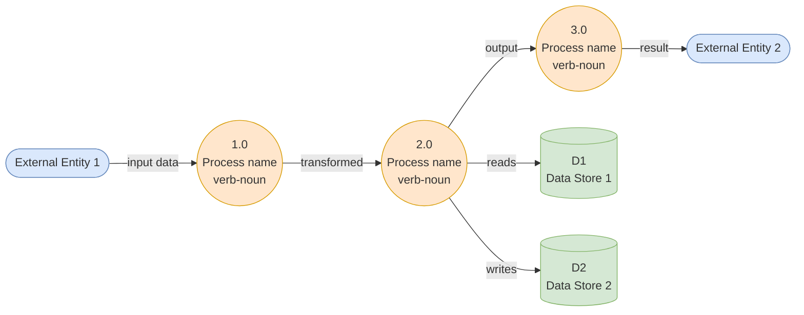

# Data Flow Diagram

> **Conceptual + specification perspective** of data movement only.
> Not a system context (that's `overview.md`), not a container shape
> (that's `containers.md`). DFD answers: **given an input, how does
> it transform as it moves through the system?**

## When to maintain a DFD

Use a DFD when the system has **non-trivial data transformations**
that are easy to get wrong:

- Multi-step validation pipelines
- Cascading fact-checks / classifications / enrichments
- Anything where a single input fans out to multiple stores or APIs

Skip the DFD for plain CRUD. A "POST creates row, GET returns row"
flow doesn't gain clarity from being drawn.

## Diagram

## Elements

### External entities

| ID | Name | Role | Sends | Receives |
|---|---|---|---|---|
| EXT-01 | Example External Entity | one-line role | what data flows in | what data flows out |

### Processes

Verb-noun naming. Every process transforms input to output — never
both Black Hole (input but no output) and Miracle (output but no input).

| ID | Name | Primitive? | Inputs | Outputs | FR |
|---|---|---|---|---|---|
| 1.0 | <Verb Noun> | no (decomposable) | from EXT-01 | to process 2.0 | FR-XX |
| 1.1 | <Verb Noun> | yes (primitive) | ... | ... | FR-XX |
| 1.2 | <Verb Noun> | yes (primitive) | ... | ... | FR-XX |

A **primitive** process is one that can't be decomposed further. Each
primitive must have a one-to-one mapping to a Mini-Spec — either a
FR file or a named function in code with a docstring.

### Data stores

| ID | Name | Description | Maps to |
|---|---|---|---|
| D1 | <Store Name> | What it holds | Postgres table `<name>` / Redis key space |
| D2 | ... | ... | ... |

### Data flows

| Flow | Source | Destination | Protocol | DD ref |
|---|---|---|---|---|
| <name> | EXT-01 | 1.0 | HTTPS / POST JSON | `docs/data/dictionary.md` § <name> |

## Balancing Rule checklist

Run through this checklist whenever the DFD changes. A balanced
decomposition has parent flows that match the sum of child flows.

- [ ] **Input matching**: the data flows entering a parent process
  (e.g. 2.0) match the flows entering its children (2.1, 2.2, ...)
  in name and count
- [ ] **Output matching**: same, for outgoing flows
- [ ] **No Black Hole**: no process has inputs but zero outputs
- [ ] **No Miracle**: no process has outputs but zero inputs
- [ ] **No Gray Hole**: every output can be *logically derived* from
  the declared inputs (e.g. "user_id" input cannot produce a "full
  payment history" output unless a payment store is also declared
  as input)
- [ ] **Data store consistency**: if a parent reads/writes D2, at
  least one child does the same
- [ ] **Terminology consistency**: a flow called "Participation
  Request Info" at the parent is not silently renamed "Application
  Data" at the child

When this checklist is on a PR, each unchecked item needs a comment
explaining why it's acceptable (sometimes a parent-only flow is
correct because it's handled internally by the parent process).

## Non-transformation flows

Events, subscriptions, and webhook callbacks don't fit cleanly in a
DFD. Two options:

1. Treat the event producer as an external entity; draw the event as
   a data flow into a "Receive Event" process
2. Maintain a separate **sequence diagram** for async flows (in a
   Mermaid `sequenceDiagram` block) alongside this DFD

## Sources

This file's Balancing Rule comes from Tom DeMarco's Structured Analysis
(1978). The guidance here is adapted for the 2026 environment where:

- Diagrams live as Mermaid code (not SVG / PNG / .vsd)
- Data stores often map to NoSQL / event logs, not just RDBMS tables
- Message queues and event buses are first-class — see "Non-transformation
  flows" above
