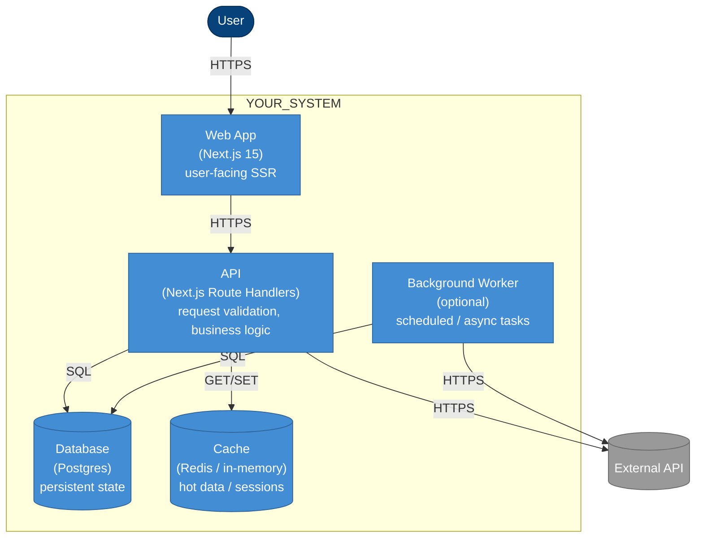

# Container diagram — C4 Level 2

> **Specification perspective.** This is one level deeper than
> `overview.md`. Here we name the runnable containers (web app, API,
> worker, database, cache) and the responsibilities each takes.
> Frameworks and concrete technologies ARE named at this level.
>
> Still not at Code level — `containers.md` doesn't show classes
> or functions. That's Level 3 (components) — deferred to the code
> itself unless a system is exceptionally complex.

## Diagram

## Containers

One row per box in the diagram.

| Container | Technology | Responsibility |
|---|---|---|
| Web App | Next.js 15 App Router | SSR pages, form submissions, minimal client state |
| API | Next.js Route Handlers | Request validation (Zod), orchestrate business logic, call DB + external APIs |
| Background Worker | (choose: BullMQ / Inngest / native cron) | Scheduled jobs, long-running tasks |
| Database | Postgres (Supabase / RDS / etc.) | Persistent state, transactional integrity |
| Cache | Redis | Session cache, rate-limit counters, hot data |

Delete any row that isn't used. For example, many MVPs have no
Worker and no Cache — `Web App + API + Database` is a legitimate
three-container system.

## Boundary rules (derived from FSD)

Each container maps to the FSD layers it's allowed to exercise:

- **Web App**: `app/`, `widgets/`, uses `features/` read models only
- **API**: all layers, especially `features/` and `entities/`
- **Worker**: only `entities/` and `shared/` — no UI-shaped logic
- **Database / Cache**: accessed **only** via `shared/api/` repository
  functions — never imported in `entities/` or `features/`
  (enforced by `npm run depcruise`)

## Deployment notes

- Web App + API share a single Next.js process (standard deployment)
- Worker runs as a separate process / container (Vercel Cron, AWS
  EventBridge, or a standalone Docker service)
- DB is a managed service; migrations live in `supabase/migrations/`
  or wherever your ORM stores them

## When to update this file

- A new container is added (e.g. introducing a search service)
- A container's technology changes (e.g. Redis → Memcached)
- A dependency edge is added or removed
- An ADR lands that shifts the architecture

Changes to this diagram without a corresponding ADR are a red flag —
architecture shifts should be deliberate decisions, not incidental edits.
