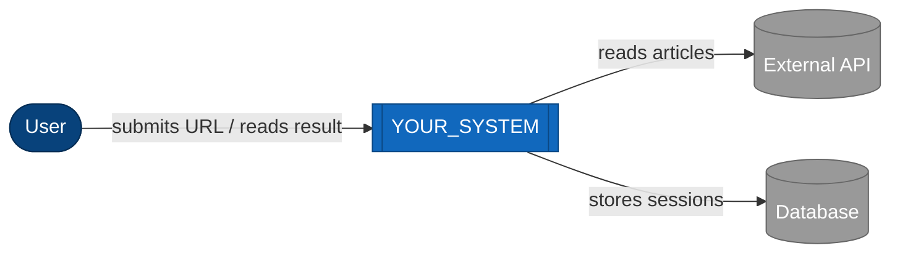

# Architecture overview — System Context (C4 Level 1)

> **Conceptual perspective only.** This file shows who uses the system
> and which external systems it talks to. No implementation details,
> no frameworks, no database names. Use business language
> (`Member`, `Article`), not technical suffixes (`MemberManager`,
> `ArticleController`).

## One-line description

> Replace this with one sentence. What does this system do, for whom?

Example: "CheckMate analyzes a news article URL and returns a
credibility score with per-claim evidence."

## System context diagram

## Actors

| Actor | Type | What they do |
|---|---|---|
| `User` | Person | The end user of the product |
| `(add more rows)` | Person or external system | |

## External systems

| System | Direction | Purpose |
|---|---|---|
| `ExternalAPI` | outbound | Why this system calls out |
| `Database` | outbound | Why this system persists state |
| `(add more rows)` | | |

## What this diagram is NOT

- It is **not** a Container Diagram (C4 Lv2). That's `containers.md`
  (opt-in: Extended module), which shows web app / API / worker / DB
  as separate boxes
- It is **not** a Data Flow Diagram. That's `DFD.md` (opt-in:
  Extended), which traces data movement between processes
- It does **not** name frameworks (Next.js, Prisma, etc.) — those
  appear at Lv2 and below

## Anti-patterns to avoid

From `.claude/rules/documentation.md` § LLM writing guidance:

- **Database-centric modeling**: don't name boxes after tables (`users`,
  `orders`). Use the domain term (`Member`, `Order`)
- **Anemic labels**: actor nodes should describe **who**, not a
  technical role. "User" is fine; "UserSession" is not
- **Arrows without labels**: every edge must describe the interaction
  in business terms ("submits URL", "reads articles"). Never a bare
  arrow
