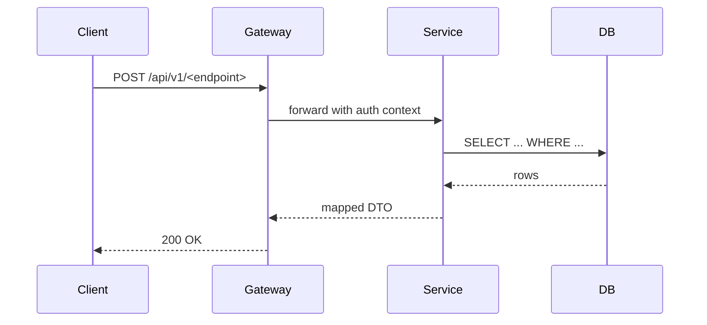

# API Analysis YYYY-MM-DD — <which API or core function>

> **Copy this file.** Rename to `api-analysis-YYYY-MM-DD-<slug>.md`.
> Use for external APIs (Google FC, Stripe, OAuth provider) or core
> internal functions whose behavior needs documenting for the team.
> The audience is a reader who needs to know **how it works, where it
> breaks, and how to work around those breaks.**

---

- **Target**: the API or function under analysis (name + version)
- **Purpose of analysis**: one sentence — why is this write-up needed?
- **Date**: YYYY-MM-DD
- **Author**: @github-handle
- **Status**: draft / reviewed / frozen

## What it does

One paragraph, business language. What problem does this API/function
exist to solve?

## How it works

Step-by-step, sequence form. A Mermaid sequence diagram belongs here.



### Key parameters / inputs

| Field | Type | Required | Notes |
|---|---|---|---|
| ... | ... | ... | ... |

### Response shape

```json
{
  "field": "value",
  "nested": { }
}
```

### Error shapes

| HTTP | Code | Meaning | Retryable? |
|---|---|---|---|
| 400 | `VALIDATION_FAILED` | bad input | no |
| 429 | `RATE_LIMITED` | too many requests | yes (backoff) |
| 500 | `INTERNAL` | transient | yes |

## Observed problems

**Quantify every claim** — if you say "coverage is low," give the
percentage. Match the CheckMate FC-API analysis style:
`Korean 10% return, English 80% return, 2% match at Jaccard ≥ 0.7`.

### Problem 1: <name>

- **Measurement**: observed rate, failure count, p95, etc.
- **Scope**: which inputs trigger it, which don't
- **Root cause** (if known): e.g. "Google FC indexes primarily
  English-language fact-check organizations; Korean fact-checkers
  have minimal representation"

### Problem 2: <name>

...

## Workarounds

For each problem, propose one or more mitigations. Table format so
pros/cons are scannable.

| Problem | Option | Pros | Cons | Effort |
|---|---|---|---|---|
| 1 | Add adapter for source X | covers gap Y | requires maintenance | 2 weeks |
| 1 | Crowdsource via Z | scales well | quality variance | 4 weeks |
| 2 | Switch to embedding similarity | catches paraphrase | adds latency + cost | 1 week |

## Recommended path

What should the team actually do? A ranked list with sprint targets.

1. **Sprint N**: adopt embedding similarity (fixes Problem 2 cleanly)
2. **Sprint N+1**: build source-X adapter behind the existing
   interface (fixes Problem 1 with zero design change)
3. **Backlog**: evaluate crowdsourced option if Sprint N+1 coverage
   is still < 50%

## Honest framing for the audience

A paragraph you could read aloud. Acknowledge what the system **can't**
do before describing what it can.

> "Tier 1 coverage in Korean is 0/50 — a data problem, not an
> algorithm problem. Our 3-tier architecture handles this gracefully
> via `score=NULL` in Tier 3 rather than hallucinating. Sprint 2 will
> address both the coverage gap (via adapter pattern) and the
> English-side matching rigidity (via embeddings)."

## Impact on architecture

Does this analysis imply an ADR is needed?

- [ ] Yes — open ADR-NNN-<slug>.md
- [ ] No — workaround is local enough to capture in an FR file

## References

- Official API docs (link + date accessed — APIs change)
- Related issues / PRs in our repo
- Third-party analyses (if cited)
