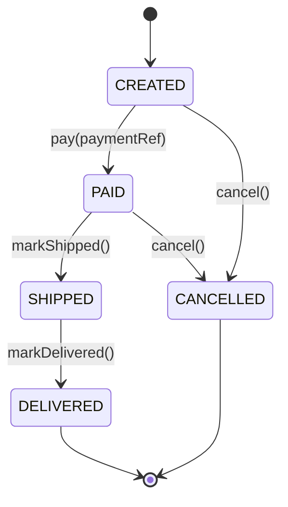

# Order Domain

Order aggregate (DISCUSS Q14 single-aggregate pilot). Order/OrderItem/Money/OrderStatus.

## Status transition

## Aggregate invariants

1. Order MUST have ≥1 OrderItem (`InvariantViolationError` on empty)
2. All `OrderItem.price` MUST share currency (`InvariantViolationError` on mismatch)
3. status transition MUST follow matrix above (`InvalidStatusTransitionError` otherwise)
4. `total` = Σ (item.quantity × item.price), unchanged after creation

학습 포인트: invariant은 method 내부 throw로 enforce. private constructor + static factory가 invalid state를 차단한다.
